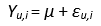
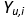
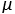
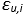
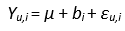
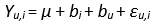
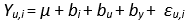
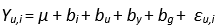
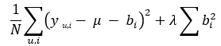
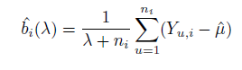

``````{r setup, include=FALSE} 


knitr::opts_chunk$set(warning = FALSE, message = FALSE) 


```


# Overview

This analysis is for HarvardX’s Data Science: Capstone MovieLens project. 

The objective of the project is to create a movie recommendation system using the MovieLens dataset. Recommender systems are the systems that are designed to recommend things to the user based on many different factors.

The root mean squared error (RMSE) is used as a metric to evaluate the performance of the movie recommendation system. The goal of the project is to create and train a machine learning model and make a
prediction with an RMSE of 0.86490 or less.

It consists of five sections and three main subsections:

It starts with this **Overview** that summarizes this analysis document contents

**Introduction** sections provides details on the goal of the analysis and the dataset that will be used.

**Methods/Analysis** that explains the process and techniques used, including data cleaning, data exploration,  modification and visualization, modeling approach and implementation.

In the **Data Preparation** subsection, the data are downloaded. Also, additional columns are added as needed for analysis.

In the **Data analysis** subsection, an exploratory data analysis of the dataset is conducted.

In the **Model Implementation** subsection, machine learning algorithms are developed to make predictions.

**Results** section presents the modeling results and discusses the model performance.

**Conclusion** is the summary of what was learned from this analysis, the report of the final RMSE, and whether the goal was achieved.


# Introduction

A recommender system or recommendation system is a subcategory of information filtering systems that attempts to predict the rating a user would give to an item. It is well-known that recommendation systems are used in a variety of domains, and commonly accepted examples take the form of playlist generators for video and music services, product recommendations for online stores, or content recommendations for social media. These systems are often used to make users' experience more personalized and to increase user engagement with an application.
A dataset from GroupLens will be used to create a system like that. Due to the size of the data, the machine learning models that will be created should not be too CPU or memory intensive.

The dataset is the 10M version of the MovieLens dataset, a bigger subset than the one available at dslabs package but still smaller that the 25M version that is used for new research.  The dataset has  10 million ratings and 100,000 tag applications applied to 10,000 movies by 72,000 users.It was released in 1/2009.

The 10M version of the movieLens dataset is available at the following link [https://grouplens.org/datasets/movielens/10m/](https://grouplens.org/datasets/movielens/10m/)


The initial dataset is split into two datasets. Edx set that is used for training, developing, selecting the algorithm and validation set for evaluating the RMSE of your final algorithm.

The dataset will be split into two sets. The first set, edx_train will be used to train models and the second, edx_test will be used for testing. A range of different models will be built from the training set, and their predictions for movie ratings will then be compared to the test subset - with an emphasis on how much they vary from one another.

Finally, the validation set is used for evaluation of the final model.

Predictions on this validation set will be evaluated using Root Mean Squared Error. The model with the lowest RMSE will be chosen to train on the entire train set and make predictions on the validation set.

{width=30%}

At the formula ŷ1,y2...ŷn are the predicted values, y1,y2...yn  are the observed values and n the number of observations.

# Methods/Analysis

## Data Preparation

Import packages, libraries and set options.

```{r}

if(!require(tidyverse)) install.packages("tidyverse",
repos = "http://cran.us.r-project.org")
if(!require(caret)) install.packages("caret",
repos = "http://cran.us.r-project.org")
if(!require(data.table)) install.packages("data.table",
repos = "http://cran.us.r-project.org")
if (!require("corrplot")) install.packages("corrplot")
if (!require("lubridate")) install.packages("lubridate")

library(tidyverse)
library(caret)
library(data.table)
library(lubridate)
library(ggplot2)
library(corrplot)


options(warn = -1) 
options(digits = 5)   
options(scipen = 999) 


```

Data are downloaded. Data comes into two files that are merged into one dataset. From this dataset the edx dataset is created that is used to train, develop the models and validation dataset that is used for for evaluating the RMSE of the final algorithm. Validation set is 10% percent of data and edx 90%. The seed is set.

```{r}


dl <- tempfile()
download.file("http://files.grouplens.org/datasets/movielens/ml-10m.zip", dl)

ratings <- fread(text = gsub("::", "\t", readLines(unzip(dl, "ml-10M100K/ratings.dat"))),
                 col.names = c("userId", "movieId", "rating", "timestamp"))

movies <- str_split_fixed(readLines(unzip(dl, "ml-10M100K/movies.dat")), "\\::", 3)
colnames(movies) <- c("movieId", "title", "genres")
# 
# # if using R 3.6 or earlier:
# movies <- as.data.frame(movies)%>%mutate(movieId=as.numeric(levels(movieId))[movieId],
#                                            title = as.character(title),
#                                            genres = as.character(genres))
# if using R 4.0 or later:
movies <- as.data.frame(movies) %>% mutate(movieId = as.numeric(movieId),
                                           title = as.character(title),
                                           genres = as.character(genres))


movielens <- left_join(ratings, movies, by = "movieId")

# Validation set will be 10% of MovieLens data
set.seed(1, sample.kind="Rounding") # if using R 3.5 or earlier, use `set.seed(1)`
test_index <- createDataPartition(y = movielens$rating, times = 1, p = 0.1, list = FALSE)
edx <- movielens[-test_index,]
temp <- movielens[test_index,]

# Make sure userId and movieId in validation set are also in edx set
validation <- temp %>% 
  semi_join(edx, by = "movieId") %>%
  semi_join(edx, by = "userId")

# Add rows removed from validation set back into edx set
removed <- anti_join(temp, validation)
edx <- rbind(edx, removed)

rm(dl, ratings, movies, test_index, temp, movielens, removed)
```

Data do not have any missing (na) values. Data investigations reveals that there are six columns, userId, MovieId, rating, timestamp, title and genres. 

UserId is an a unique identifier number for each user and is integer. Accordingly the  movieId is an identifier for the movies but its datatype is numeric . Rating is numeric and has values from 0 to 5  by 0.5  increments. Timestamp of type integer is the time when the  review was done, in unix timestamp format. Title is a character data type variable that not only provides the title of the movie but also the year the movie was released. Last of all,  character variable genres show in which genre or genres the movie belongs.

```{r}

anyNA(edx)
anyNA(validation)

head(edx)
str(edx)


```


Timestamp column is the year the movie was rated but it is in a format that does not facilitate the analysis. Moreover the release year of the movie is inside the title column. Three columns will be added to edx and validation datasets.


Column yearReleased will hold the year of the movie released, yearRated will describe the year each movie is rated, and yearsToRate will be the span in years between the year released and the year it was rated.


```{r}


edx <- mutate(edx, yearReleased =as.numeric(str_sub(title,-5, -2)))
edx <- mutate(edx, yearRated = year(as_datetime(timestamp)))
edx <- mutate(edx, yearsTorate = yearRated - yearReleased)


validation <- mutate(validation,yearReleased=as.numeric(str_sub(title,-5, -2)))
validation <- mutate(validation, yearRated = year(as_datetime(timestamp)))
validation <- mutate(validation, yearsTorate = yearRated - yearReleased)

```

## Data analysis

From now on, the edx dataset is analyzed and used until the project reaches the validation phase.
The edx has 9000055 observations with 9 variables for each.

```{r  tidy=TRUE, tidy.opts=list(width.cutoff=160)}

head(edx)
dim(edx)
str(edx)

```


We can see how many unique users and unique movies the dataset has.

```{r}
edx %>% summarize(no_users  = n_distinct(userId), 
no_movies = n_distinct(movieId)) %>% knitr::kable()
```


A random sample of 180 users and 180 movies reveals that users rate a portion of the available movies.


```{r}

users <- sample(unique(edx$userId), 180)
rafalib::mypar()
edx %>% filter(userId %in% users) %>%
  dplyr::select(userId, movieId, rating) %>%
   mutate(rating = 1) %>%
  spread(movieId, rating) %>% dplyr::select(sample(ncol(.), 180)) %>%
  as.matrix() %>% t(.) %>%
  image(1:180, 1:180,. , xlab="Movies", ylab="Users")
abline(h=0:180+0.5, v=0:180+0.5, col = "grey")


```

Some movies have more ratings than others, and some users rate more movies than others. Therefore, movie bias and user bias will be used as predictors.

```{r}

edx %>% count(movieId) %>% ggplot(aes(n))+
  geom_histogram(color = "black")+
  scale_x_log10()+
  ggtitle("Rating Count Per Movie")


edx %>% count(userId) %>% ggplot(aes(n))+
  geom_histogram(color = "black")+
  ggtitle("Rating Count Per User")+
  scale_x_log10()
```

By examining the dataset more information and possible predictors are extracted. The correlation plot shows that there is a relatively high correlation between rating and yearReleased and YearsToRate.

```{r}

temp <- edx %>% select(one_of("rating", "movieId", "userId",
                "yearReleased","yearRated","yearsTorate")) %>% as.matrix()
M <- cor(temp, use = "pairwise.complete.obs")

corrplot(M)

```

The mean rating is 3.5 and the distribution of the rating frequency is left-skewed. More rates most of the times means better average rate, though a rate of 5 is not so easily granted as a rate of 4. Half points like 2.5, 3.5 etc are not so common as  full point rates.


```{r}

mean(edx$rating)

edx %>%
  ggplot(aes(rating)) +
  geom_histogram(binwidth = 0.25) +
  scale_y_continuous(labels = scales::comma) +
  stat_count(aes(y=..count..,label=..count..),geom="text",vjust=0) +
  ggtitle("Rating Frequency")

```


The distribution of the number of ratings to years released shows that 1993 was the peak year with the most entries.

``` {r}
edx %>% ggplot(aes(x=yearReleased)) +
    geom_histogram(binwidth = 2) +
    ggtitle("Ratings Per Release Year") +
    xlab("Year Released") +
    ylab("Number of Ratings")
```


The increase of the distance between the year a movie is released and the year is rated makes the average rating going higher. The correlation is more obvious when a filter is implemented.


```{r}

edx %>%
  group_by(yearsTorate) %>%
  summarize(m_rating = mean(rating)) %>%
  ggplot(aes(yearsTorate,m_rating)) +
  geom_point() +
  geom_smooth(method = 'loess', formula = y ~ x) +
  ggtitle("Years Between Release And Rate")

```


Filtering the data by removing those with fewer than 10000 entries, it seems that people rate old movies with higher rating than the average, possibly because they see classic or well known and beloved movies of the past. This effect declines if a movie is rated after about 60 years of its release.

This distance is a good candidate as a predictor for the recommendation system.


```{r}
edx %>%
  group_by(yearsTorate) %>%
  filter(n() >= 10000) %>%
  summarize(m_rating = mean(rating)) %>%
  ggplot(aes(yearsTorate,m_rating)) +
  geom_point() +
  geom_smooth(method = 'loess', formula = y ~ x) +
  ggtitle("Years Between Release And Rate (>10000 Entries)")

```


Finally another predictor is the genres. There are  797 genres. Some genres  are just a combination of multiple other genres. For example in the dataset many movies have genre such as Action|Adventure. Some genres are rated higher than the others.  I filtered the data to only show movies that have up to 2 genres and have at least 10000 entries. If the data  are filtered  only to the movies that have many entries (>100000), their rating is getting closer to the mean rating.


```{r}

number_of_genres <- edx %>% group_by(genres) %>% summarize(n = n())

number_of_genres

```


```{r}

edx %>% group_by(genres) %>%
  summarize(n = n(), avg = mean(rating), se = sd(rating)/sqrt(n())) %>%
  filter(n >= 10000 & str_count(genres,"\\|")<2) %>%
  mutate(genres = reorder(genres, avg)) %>%
  ggplot(aes(x = genres, y = avg, ymin = avg - 2*se, ymax = avg + 2*se)) +
  geom_point() +
  geom_errorbar() +
  theme(axis.text.x = element_text(angle = 90, hjust = 1))

edx %>% group_by(genres) %>%
  summarize(n = n(), avg = mean(rating), se = sd(rating)/sqrt(n())) %>%
  filter(n >= 100000 & str_count(genres,"\\|")<2) %>%
  mutate(genres = reorder(genres, avg)) %>%
  ggplot(aes(x = genres, y = avg, ymin = avg - 2*se, ymax = avg + 2*se)) +
  geom_point() +
  geom_errorbar() +
  theme(axis.text.x = element_text(angle = 90, hjust = 1))+
  ggtitle("Average Rate By Genre (More Than 100000 Rates)")


```


## Model Implementation

### Average Movie Model

The residual mean square error RMSE is used to measure the differences between the test and the predicted values by the model. The goal is to achieve RMSE below 0.8649.


```{r}

RMSE <- function(true_ratings, predicted_ratings){
  sqrt(mean((true_ratings - predicted_ratings)^2))
}

```

```{r}

set.seed(1,sample.kind = "Rounding")
test_index <- createDataPartition(y = edx$rating,
times = 1, p = 0.1, list = FALSE)

edx_test <- edx[test_index]
edx_train <- edx[-test_index]
temp <- edx_test
edx_test <- temp %>%
  semi_join(edx_train, by = "movieId") %>%
  semi_join(edx_train, by = "userId")
removed <- anti_join(temp, edx_test, by = c("userId", "movieId"))
edx_train <- rbind(edx_train, removed)
rm(temp,removed)

```


```{r}
rmse_results <- tibble(method = "Project Target", RMSE = 0.86490)
rmse_results %>% knitr::kable()

```


I begin by implementing the simplest model, the mean from the entire dataset.
The model looks like this:

{width=12%}


{width=18} is the rating for movie i by user u, {width=8}  is the mean rating for all movies and {width=18} is the independent errors sampled from the same distribution centered at 0.


```{r}
mu <- mean(edx_train$rating)
mu
```

```{r}

naive_rmse <- RMSE(edx_test$rating, mu)


rmse_results <- bind_rows(rmse_results,
data_frame(method="Average Movie Rating Model",
 RMSE = naive_rmse ))
 rmse_results %>% knitr::kable()

```


### Movie Effect Model

I estimate the least squares by taking the mean of the rating for each movie minus the overall rating mean I have already calculated. A linear regression in not used here due to the size of the dataset. An improved prediction using movie effect is produced.

Below is the new formula with the addition of b_i that is the movie bias.

{width=15%}

```{r}

movie_avgs <- edx_train %>%
  group_by(movieId) %>%
  summarize(b_i = mean(rating - mu))


predicted_ratings <- mu + edx_test %>%
  left_join(movie_avgs, by='movieId') %>%
  .$b_i

model_1_rmse <- RMSE(predicted_ratings, edx_test$rating)
rmse_results <- bind_rows(rmse_results,
data_frame(method="Movie Effect Model",
 RMSE = model_1_rmse ))

```

### Movie Effect and User Effect Model

In order to make a better prediction, I will implement the user effect, named b_u into the model. The estimation of least squares is done by taking the mean of the rating for each movie minus the overall rating mean minus the movie effect. The predictors give an even better result.

{width=18%}


```{r}

user_avgs <- edx_train %>%
  left_join(movie_avgs, by='movieId') %>%
  group_by(userId) %>%
  summarize(b_u = mean(rating - mu - b_i))


predicted_ratings <- edx_test %>%
  left_join(movie_avgs, by='movieId') %>%
  left_join(user_avgs, by='userId') %>%
  mutate(pred = mu + b_i + b_u) %>%
  .$pred


model_2_rmse <- RMSE(predicted_ratings, edx_test$rating)
rmse_results <- bind_rows(rmse_results,
data_frame(method="Movie + User Effect Model",
RMSE = model_2_rmse ))

rmse_results %>% knitr::kable()


```

### Movie, User and YearsToRate Effect Model

It's now time to improve the model a little bit more. YearsToRate column was created and calculated by the time difference in years between the release date of the movie and the year it was rated for each entry.I'm going to continue following the same logic I used before in order to add in the movies YearsTorate effect. The least squares estimation is accomplished by taking the mean of the rating and subtracting overall rating mean, movie effect and user effect.

The model after the addition of b_y that is the YearsToRate effect.

{width=22%}

```{r}

yearsTorate_avgs <- edx_train %>%
  left_join(movie_avgs, by='movieId') %>%
  left_join(user_avgs, by='userId') %>%
  group_by(yearsTorate) %>%
  summarize(b_y = mean(rating - mu - b_i - b_u))


predicted_ratings <- edx_test%>%
  left_join(movie_avgs, by='movieId') %>%
  left_join(user_avgs, by='userId') %>%
  left_join(yearsTorate_avgs, by='yearsTorate') %>%
  mutate(pred = mu + b_i + b_u + b_y) %>%
  .$pred


model_3_rmse <- RMSE(predicted_ratings, edx_test$rating)
rmse_results <- bind_rows(rmse_results,
data_frame(method="Movie + User + YearsToRate Effect Model",
RMSE = model_3_rmse ))

rmse_results %>% knitr::kable()

```


### Movie and User,Genre and YearsToRate Effect Model

Finally i will add to the model the Genre Effect.  I estimate the least squares as before but this time I subtract from the overall mean and genre effect. The RMSE has improved a lot.

The model after the addition of b_g that is the Genre effect.

{width=24%}

```{r}

genre_avgs <- edx_train %>%
  left_join(movie_avgs, by='movieId') %>%
  left_join(user_avgs, by='userId') %>%
  left_join(yearsTorate_avgs, by='yearsTorate') %>%
  group_by(genres) %>%
  summarize(b_g = mean(rating - mu - b_i - b_u- b_y))


predicted_ratings <- edx_test%>%
  left_join(movie_avgs, by='movieId') %>%
  left_join(user_avgs, by='userId') %>%
  left_join(genre_avgs, by='genres') %>%
  left_join(yearsTorate_avgs, by='yearsTorate') %>%
  mutate(pred = mu + b_i + b_u + b_y + b_g) %>%
  .$pred


model_4_rmse <- RMSE(predicted_ratings, edx_test$rating)
rmse_results <- bind_rows(rmse_results,
                data_frame(method="Movie + User + YearsToRate + Genre Effect Model",
                RMSE = model_4_rmse ))

rmse_results %>% knitr::kable()


```

## Regularization


In the initial data analysis, I observed that some movies were rated by only a few users. Therefore, these movies were greatly affected by few ratings.  A movie that has one rating of five means more that the user that only rated this movie liked it very much than that its really has an average of five. Without having many entries, the resulting average is not trustworthy.

In order to constrain this effect,movies with large estimates from a small sample size, i will use regularization by implementing a penalty with a variable named lambda.

For example to regularize the movie bias b_i, i will use the following formula. The first term is the least squares and the second is the penalty that gets larger when many b_i gets larger. 

{width=32%}

To minimize this equation, that is minimizing the least squares plus penalty, is to find the appropriate b_i that does that. Using the formula below, it is observable that a large n_i, number of ratings for movies i, renders lambda in denominator insignificant.A small n_i makes the result estimate to shrink.

{width=32%}

I will use cross-validation to tune lambda. When the result of the formula is minimal, the lambda is optimal.

### Regularized Movie Effect Model

I will use the movie bias b_i and the aforementioned formulas for the first regularized model. The optimal lambda will be researched.


```{r}


lambdas <- seq(0, 10, 1)

mu <- mean(edx_train$rating)


just_the_sum <- edx_train %>%
  group_by(movieId) %>%
  summarize(s = sum(rating - mu), n_i = n())


rmses <- sapply(lambdas, function(l){
  predicted_ratings <- edx_test %>%
    left_join(just_the_sum, by='movieId') %>%
    mutate(b_i = s/(n_i+l)) %>%
    mutate(pred = mu + b_i) %>%
    .$pred
  return(RMSE(predicted_ratings, edx_test$rating))
})
qplot(lambdas, rmses)

lambdas[which.min(rmses)]

model_5_rmse <- RMSE(predicted_ratings, edx_test$rating)
rmse_results <- bind_rows(rmse_results,
                          data_frame(method="Regularized Movie Effect Model",
                          RMSE = min(rmses)))

rmse_results %>% knitr::kable()

```

### Regularized Movie User,Genre,YearsToRate Effect Model

Regularization gives a better result on the model that incorporates Movie Effect. Now the penalty will be used on a model that implements Movie and User and Genre and  YearsToRate Effect Model. Moreover i will try to better tune the parameter even more.It takes much more time for the CPU to do the calculations.


```{r}

lambdas_optimal <- seq(2, 8, 0.1)

rmses <- sapply(lambdas_optimal, function(l){

  mu <- mean(edx_train$rating)

  b_i <- edx_train %>%
  group_by(movieId) %>%
  summarize(b_i = sum(rating - mu)/(n()+l))

  b_u <- edx_train %>%
  left_join(b_i, by="movieId") %>%
  group_by(userId) %>%
  summarize(b_u = sum(rating - b_i - mu)/(n()+l))

  b_y <- edx_train %>%
  left_join(b_i, by="movieId") %>%
  left_join(b_u, by="userId") %>%
  group_by(yearsTorate) %>%
  summarize(b_y = sum(rating - b_u - b_i - mu)/(n()+l))

  b_g <- edx_train %>%
  left_join(b_i, by="movieId") %>%
  left_join(b_u, by="userId") %>%
  left_join(b_y, by="yearsTorate") %>%
  group_by(genres) %>%
  summarize(b_g = sum(rating - b_y - b_u - b_i - mu)/(n()+l))


  predicted_ratings <-
   edx_test %>%
  left_join(b_i, by="movieId") %>%
  left_join(b_u, by="userId") %>%
  left_join(b_y, by="yearsTorate") %>%
  left_join(b_g, by="genres") %>%
  mutate(pred = mu + b_i + b_u + b_y + b_g) %>%
  pull(pred)

  return(RMSE(predicted_ratings,  edx_test$rating))
})


qplot(lambdas_optimal, rmses, main = "Optimal Lambda") +
theme(plot.title = element_text(hjust = 0.5))

lambdas_optimal[which.min(rmses)]

rmse_results <- bind_rows(rmse_results,
data_frame(method="Regularized Movie + User + Genre + YearsToRate Effect Model",
RMSE = min(rmses)))


rmse_results %>% knitr::kable()

```

# Results

## Model Implementation Results

The first and simplest model, the mean, attained an RMSE of 1.06005. By implementing successive models adding more predictors starting by Movie bias and then adding User bias, Genre bias and YearsToRate effect an RMSE of 0.86390 was possible. Moreover, using regularization, on all predictors  the final model 0.86336 was accomplished.

These are the models implemented and the RMSE achieved.

```{r}

rmse_results %>% knitr::kable()

```

## Validation Result

The best RMSE was achieved by the Regularized Movie + User + Genre + YearsToRate Effect Model. This model is evaluated with the validation set in order to get a final RMSE result. The resulted MRSE is 0.86438.


```{r}

lambdas_optimal <- seq(2, 8, 0.1)

rmses <- sapply(lambdas_optimal, function(l){

  mu <- mean(edx_train$rating)

  b_i <- edx_train %>%
    group_by(movieId) %>%
    summarize(b_i = sum(rating - mu)/(n()+l))

  b_u <- edx_train %>%
    left_join(b_i, by="movieId") %>%
    group_by(userId) %>%
    summarize(b_u = sum(rating - b_i - mu)/(n()+l))

  b_y <- edx_train %>%
    left_join(b_i, by="movieId") %>%
    left_join(b_u, by="userId") %>%
    group_by(yearsTorate) %>%
    summarize(b_y = sum(rating - b_u - b_i - mu)/(n()+l))

  b_g <- edx_train %>%
    left_join(b_i, by="movieId") %>%
    left_join(b_u, by="userId") %>%
    left_join(b_y, by="yearsTorate") %>%
    group_by(genres) %>%
    summarize(b_g = sum(rating - b_y - b_u - b_i - mu)/(n()+l))


  predicted_ratings <-
    validation %>%
    left_join(b_i, by="movieId") %>%
    left_join(b_u, by="userId") %>%
    left_join(b_y, by="yearsTorate") %>%
    left_join(b_g, by="genres") %>%
    mutate(pred = mu + b_i + b_u + b_y + b_g) %>%
    pull(pred)

  return(RMSE(predicted_ratings, validation$rating))
})


lambdas_optimal[which.min(rmses)]

rmse_results <- bind_rows(rmse_results,
data_frame(method="Validation vs Regularized Movie+User+Genre+YearsToRate Effect Model",
 RMSE = min(rmses)))


rmse_results %>% knitr::kable()
```


# Conclusion

The recommendation system model was able to reach the goal of a smaller RMSE than 0.86490 without using and any CPU intensive machine learning model. It was achieved by modeling movie bias, user bias, the effect of years elapsed from the release date and rate date, genre bias and by adding a penalty to constrain the total variability of the effect sizes that come from small sample sizes.

Creativity in making a model can result in satisfactory results without using a ready to deploy solution that may provide better results but is resource intensive.

Limitations on CPU and RAM prevented the use of an SVD or random forest based approach that would probably achieve far better results and that should be my next step. Furthermore, The use of recommenderlab, a library for developing and testing recommender algorithms looks promising.
